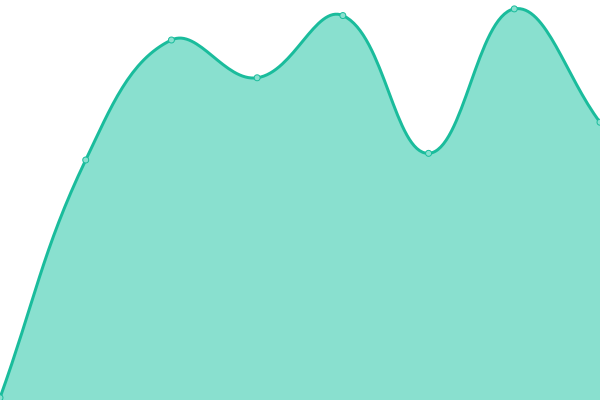
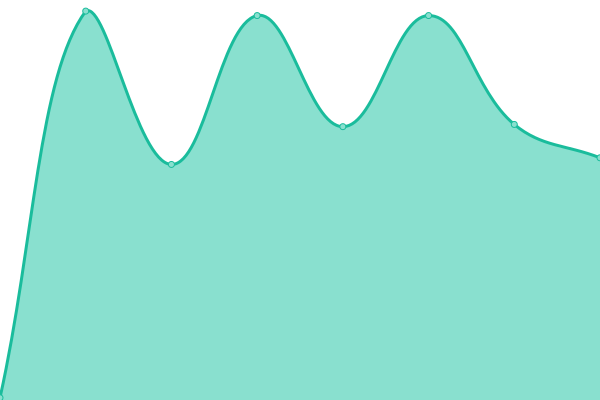
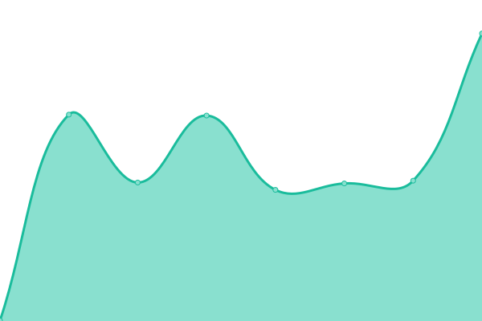
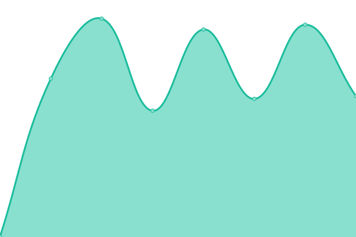
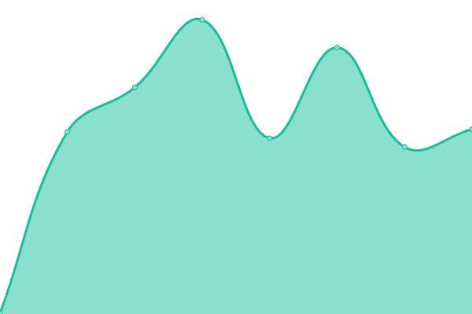
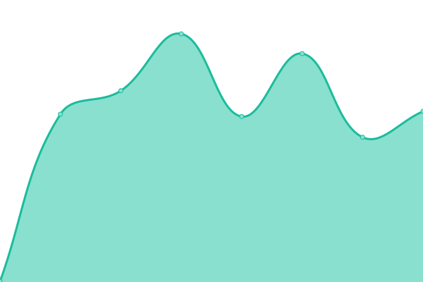
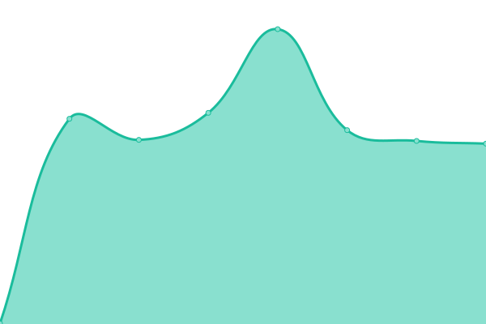

# [📈 Live Status](https://alenhorvat.github.io/monitoring): <!--live status--> **🟧 Partial outage**

This repository contains the open-source uptime monitor and status page for [Alen Horvat](https://www.linkedin.com/in/alen-horvat-0418b551), powered by [Upptime](https://github.com/upptime/upptime).

With [Upptime](https://upptime.js.org), you can get your own unlimited and free uptime monitor and status page, powered entirely by a GitHub repository. We use [Issues](https://github.com/alenhorvat/monitoring/issues) as incident reports, [Actions](https://github.com/alenhorvat/monitoring/actions) as uptime monitors, and [Pages](https://alenhorvat.github.io/monitoring) for the status page.

<!--start: status pages-->
<!-- This summary is generated by Upptime (https://github.com/upptime/upptime) -->
<!-- Do not edit this manually, your changes will be overwritten -->
<!-- prettier-ignore -->
| URL | Status | History | Response Time | Uptime |
| --- | ------ | ------- | ------------- | ------ |
|  AceBlock Homepage | 🟩 Up | [ace-block-homepage.yml](https://github.com/alenhorvat/monitoring/commits/HEAD/history/ace-block-homepage.yml) | 

 3255ms
     
 | 

<a href="https://alenhorvat.github.io/monitoring/history/ace-block-homepage">98.79%</a>
    

|  AceBlock SSI - RPC endpoint | 🟥 Down | [ace-block-ssi-rpc-endpoint.yml](https://github.com/alenhorvat/monitoring/commits/HEAD/history/ace-block-ssi-rpc-endpoint.yml) | 

 429ms
     
 | 

<a href="https://alenhorvat.github.io/monitoring/history/ace-block-ssi-rpc-endpoint">0.00%</a>
    

|  AceBlock SSI - IPFS endpoint | 🟩 Up | [ace-block-ssi-ipfs-endpoint.yml](https://github.com/alenhorvat/monitoring/commits/HEAD/history/ace-block-ssi-ipfs-endpoint.yml) | 

 424ms
     
 | 

<a href="https://alenhorvat.github.io/monitoring/history/ace-block-ssi-ipfs-endpoint">100.00%</a>
    

|  AceBlock Documentation | 🟩 Up | [ace-block-documentation.yml](https://github.com/alenhorvat/monitoring/commits/HEAD/history/ace-block-documentation.yml) | 

 405ms
     
 | 

<a href="https://alenhorvat.github.io/monitoring/history/ace-block-documentation">100.00%</a>
    

|  AceBlock Swagger UI | 🟩 Up | [ace-block-swagger-ui.yml](https://github.com/alenhorvat/monitoring/commits/HEAD/history/ace-block-swagger-ui.yml) | 

 453ms
     
 | 

<a href="https://alenhorvat.github.io/monitoring/history/ace-block-swagger-ui">100.00%</a>
    

|  Load balancer Gen-I | 🟩 Up | [load-balancer-gen-i.yml](https://github.com/alenhorvat/monitoring/commits/HEAD/history/load-balancer-gen-i.yml) | 

 124ms
     
 | 

<a href="https://alenhorvat.github.io/monitoring/history/load-balancer-gen-i">100.00%</a>
    

|  VerifyCity | 🟥 Down | [verify-city.yml](https://github.com/alenhorvat/monitoring/commits/HEAD/history/verify-city.yml) | 

 0ms
     
 | 

<a href="https://alenhorvat.github.io/monitoring/history/verify-city">0.00%</a>
    

|  NFT | 🟩 Up | [nft.yml](https://github.com/alenhorvat/monitoring/commits/HEAD/history/nft.yml) | 

 411ms
     
 | 

<a href="https://alenhorvat.github.io/monitoring/history/nft">100.00%</a>
    

|  NID-home | 🟩 Up | [nid-home.yml](https://github.com/alenhorvat/monitoring/commits/HEAD/history/nid-home.yml) | 

 449ms
     
 | 

<a href="https://alenhorvat.github.io/monitoring/history/nid-home">100.00%</a>
    

|  NID-I | 🟩 Up | [nid-i.yml](https://github.com/alenhorvat/monitoring/commits/HEAD/history/nid-i.yml) | 

 388ms
     
 | 

<a href="https://alenhorvat.github.io/monitoring/history/nid-i">100.00%</a>
    

|  NID-W | 🟥 Down | [nid-w.yml](https://github.com/alenhorvat/monitoring/commits/HEAD/history/nid-w.yml) | 

 3362ms
     
 | 

<a href="https://alenhorvat.github.io/monitoring/history/nid-w">0.00%</a>
    

|  NID-P | 🟩 Up | [nid-p.yml](https://github.com/alenhorvat/monitoring/commits/HEAD/history/nid-p.yml) | 

 377ms
     
 | 

<a href="https://alenhorvat.github.io/monitoring/history/nid-p">100.00%</a>
    

|  NID-DPP | 🟩 Up | [nid-dpp.yml](https://github.com/alenhorvat/monitoring/commits/HEAD/history/nid-dpp.yml) | 

 421ms
     
 | 

<a href="https://alenhorvat.github.io/monitoring/history/nid-dpp">100.00%</a>
    

|  NID-MV | 🟩 Up | [nid-mv.yml](https://github.com/alenhorvat/monitoring/commits/HEAD/history/nid-mv.yml) | 

 378ms
     
 | 

<a href="https://alenhorvat.github.io/monitoring/history/nid-mv">100.00%</a>
    

|  SKILLJOT | 🟥 Down | [skilljot.yml](https://github.com/alenhorvat/monitoring/commits/HEAD/history/skilljot.yml) | 

 0ms
     
 | 

<a href="https://alenhorvat.github.io/monitoring/history/skilljot">0.00%</a>
    

<!--end: status pages-->

[**Visit our status website →**](https://alenhorvat.github.io/monitoring)

## 📄 License

- Powered by: [Upptime](https://github.com/upptime/upptime)
- Code: [MIT](./LICENSE) © [Alen Horvat](https://www.linkedin.com/in/alen-horvat-0418b551)
- Data in the `./history` directory: [Open Database License](https://opendatacommons.org/licenses/odbl/1-0/)
